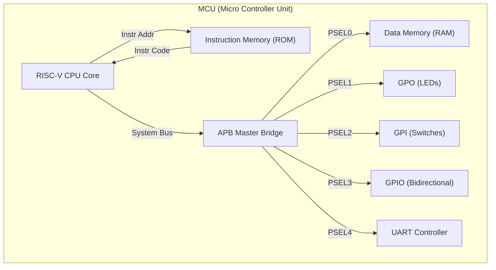

# 🚀 SystemVerilog RISC-V RV32I MCU SoC

\<div align="center"\>

\
\
\
\
\

<br>

**32-bit RISC-V CPU Core + APB Interconnect + Peripherals (GPIO, UART)**<br>
단일 사이클 CPU 코어와 표준 버스 프로토콜을 기반으로 설계된 FPGA 임베디드 MCU 시스템

\</div\>

-----

## 📖 1. 프로젝트 개요 (Overview)

이 프로젝트는 **SystemVerilog**를 사용하여 **RISC-V RV32I (Base Integer Instruction Set)** 아키텍처를 구현한 프로세서 설계입니다. CPU 코어는 **Control Unit**과 **DataPath**로 명확히 분리되어 있으며, 최상위 모듈인 `MCU`에서 **AMBA APB 프로토콜**을 통해 메모리 및 다양한 주변장치(UART, GPIO)와 통합되어 실제 임베디드 어플리케이션을 실행할 수 있는 SoC 구조를 갖추고 있습니다.

### ✨ 핵심 설계 특징 (Key Features)

  * **RISC-V Core:** 산술/논리, 메모리, 분기 등 RV32I 명령어 셋을 완벽히 지원하는 단일 사이클 프로세서.
  * **Bus System:** 표준 **AMBA APB 3.0 Protocol**을 구현한 Master Bridge를 통해 시스템 확장성 확보[cite: 1312].
  * **Memory Architecture:**
      * **Instruction Memory (ROM):** 프로그램 코드 저장 (Read Only).
      * **Data Memory (RAM):** APB 슬레이브로 동작하는 4KB 데이터 저장소.
  * **Peripherals:**
      * [cite_start]**GPIO:** GPO(LED 제어), GPI(Switch 입력), GPIO(양방향 입출력) 모듈 탑재[cite: 1377].
      * [cite_start]**UART:** 송수신(Tx/Rx) FIFO 및 상태 레지스터를 갖춘 시리얼 통신 컨트롤러[cite: 135].
  * [cite_start]**Advanced Verification:** Transaction, Driver, Monitor, Scoreboard 클래스를 활용한 **Constrained Random Verification** 환경 구축[cite: 1153].

-----

## 🏗️ 2. 시스템 아키텍처 (System Architecture)

### 2.1 MCU Top-Level Diagram

CPU는 명령어 버스와 데이터 버스가 분리된 Harvard Architecture 구조를 가지며, 데이터 버스는 APB Bridge를 통해 주변 장치들과 연결됩니다.



### 2.2 APB Memory Map

[cite_start]`APB_Master` 내부의 디코더(`APB_Decoder`)에 의해 주소 공간이 다음과 같이 할당됩니다 [cite: 1343-1348].

| Slave Device | Base Address | Description | PSEL Index |
| :--- | :--- | :--- | :---: |
| **RAM** | `0x1000_0000` | 데이터 메모리 (Read/Write) | PSEL0 |
| **GPO** | `0x1000_1000` | 출력 포트 (LED Control) | PSEL1 |
| **GPI** | `0x1000_2000` | 입력 포트 (Switch Input) | PSEL2 |
| **GPIO** | `0x1000_3000` | 범용 양방향 입출력 포트 | PSEL3 |
| **UART** | `0x1000_4000` | 시리얼 통신 (Tx/Rx Data & Status) | PSEL4 |

-----

## 💻 3. CPU 상세 기능 명세 (Detailed Specification)

각 명령어 타입별 \*\*데이터 흐름(Data Flow)\*\*과 **제어 신호(Control Signal)** 동작 방식입니다.

### 3.1 R-Type (Register-Register)

레지스터 간의 산술 및 논리 연산을 수행합니다.

  * **Instructions:** `ADD`, `SUB`, `SLL`, `SLT`, `XOR`, `SRL`, `OR`, `AND` 등.
  * **Data Flow:**
    1.  ROM에서 명령어를 인출(Fetch)합니다.
    2.  Register File에서 `rs1`, `rs2` 데이터를 읽어 ALU로 전달합니다.
    3.  [cite_start]ALU 연산 결과가 MUX(0번 입력)를 통해 다시 Register File(`rd`)에 저장됩니다[cite: 359].
  * **Control Signals:**
      * `reg_wr_en = 1`: 연산 결과를 저장하기 위해 활성화.
      * `aluSrcMuxSel = 0`: 두 번째 피연산자로 레지스터값(`rs2`) 선택.
      * `RegWdataSel = 0`: ALU 결과를 저장 데이터로 선택.

### 3.2 I-Type (Immediate / Load)

상수 연산 또는 메모리 로드 명령을 수행합니다.

  * **Instructions:** `ADDI`, `ANDI`, `LB`, `LW`, `JALR` 등.
  * **Data Flow (Arithmetic):**
    1.  `rs1` 값과 확장된 `imm` 값이 ALU에서 연산됩니다.
    2.  결과가 Register File에 저장됩니다.
  * **Data Flow (Load):**
    1.  ALU에서 `rs1 + imm` 주소를 계산합니다.
    2.  [cite_start]APB Bus를 통해 RAM의 해당 주소 데이터를 읽어 MUX(1번 입력)를 통해 Register File에 저장합니다[cite: 358].
  * **Control Signals (Load):**
      * `reg_wr_en = 1`: 데이터 저장을 위해 활성화.
      * `aluSrcMuxSel = 1`: 주소 계산을 위해 상수(`imm`) 선택.
      * `RegWdataSel = 1`: 메모리에서 읽은 데이터(`busRData`) 선택.

### 3.3 S-Type (Store)

레지스터의 값을 메모리에 저장합니다.

  * **Instructions:** `SB` (Byte), `SH` (Half), `SW` (Word).
  * **Data Flow:**
    1.  `rs1 + imm`을 통해 저장할 메모리 주소를 계산합니다.
    2.  `rs2`의 값을 RAM(또는 Peripheral)의 데이터 포트로 전달합니다.
  * **Control Signals:**
      * [cite_start]`d_wr_en (busWe) = 1`: 버스 쓰기 활성화[cite: 229].
      * `aluSrcMuxSel = 1`: 주소 계산용 상수 선택.

### 3.4 B-Type (Branch)

조건부 분기를 수행합니다.

  * **Instructions:** `BEQ`, `BNE`, `BLT`, `BGE` 등.
  * **Data Flow:**
    1.  비교기(Comparator)가 `rs1`과 `rs2`를 비교하여 `b_taken` 신호를 생성합니다.
    2.  [cite_start]`b_taken`이 참이면 `PC = PC + imm`, 거짓이면 `PC = PC + 4`로 업데이트됩니다[cite: 366].
  * **Control Signals:**
      * `branch = 1`: 분기 명령어임을 알림.
      * `aluSrcMuxSel = 0`: 비교를 위해 레지스터값 선택.

### 3.5 U-Type (Upper Immediate)

상위 20비트 상수를 처리합니다.

  * **Instructions:** `LUI`, `AUIPC`.
  * **Data Flow:**
    1.  20비트 `imm`을 32비트로 확장(하위 12비트 0)합니다.
    2.  `LUI`: 확장된 값을 그대로 저장. `AUIPC`: `PC + imm` 값을 저장.
  * **Control Signals (LUI):**
      * `RegWdataSel = 2`: ALU를 거치지 않은 Immediate 값 선택.

### 3.6 J-Type (Jump)

무조건 점프 및 복귀 주소 저장을 수행합니다.

  * **Instructions:** `JAL`, `JALR`.
  * **Data Flow:**
    1.  점프할 주소(`PC + imm` 또는 `rs1 + imm`)를 계산하여 PC를 업데이트합니다.
    2.  복귀 주소(`PC + 4`)를 Register File에 저장합니다.
  * **Control Signals:**
      * `jal = 1`: PC 점프 활성화.
      * `RegWdataSel = 4`: `PC + 4` 값을 저장 데이터로 선택.

-----

## 🔌 4. 버스 및 주변장치 상세 설계 (Bus & Peripherals Detail)

### 4.1 APB Master Bridge (`APB_Master.sv`)

CPU의 제어 신호(`busWe`, `addr`, `wdata`)를 받아 표준 APB 프로토콜의 3단계 상태 머신으로 변환합니다.

  * [cite_start]**FSM State Machine** [cite: 1329-1338]:
    1.  **IDLE:** 전송 요청(`transfer`) 대기. 요청 시 주소와 데이터를 래치하고 `SETUP`으로 천이.
    2.  **SETUP:** `PSELx`를 활성화하고 `PENABLE`을 0으로 설정. 다음 클럭에 `ACCESS`로 천이.
    3.  **ACCESS:** `PENABLE`을 1로 설정. 슬레이브의 `PREADY`가 1이 될 때까지 대기 후 `IDLE`로 복귀.
  * **Address Decoder:** `addr[15:12]` 비트를 디코딩하여 5개의 Slave 중 하나를 선택(`PSEL0`\~`PSEL4`)합니다.

### 4.2 UART Controller (`UART_ph.sv`)

APB 버스와 UART 모듈 간의 인터페이스를 담당하며, 내부 레지스터를 통해 제어됩니다.

  * [cite_start]**Internal Register Map** [cite: 146-147]:
      * `0x00` (Write): **TX Data Register**. 값을 쓰면 `tx_start` 신호가 발생하여 전송 시작.
      * `0x04` (Read): **RX Data Register**. 수신된 데이터가 저장됨.
      * `0x08` (Read): **Status Register**. `bit[0]: tx_busy`, `bit[1]: rx_data_ready`.
  * **Baud Rate Gen:** 100MHz 시스템 클럭을 분주하여 9600bps 통신 속도를 생성합니다.

### 4.3 GPIO Modules (`GPIO.sv`, `GPO.sv`, `GPI.sv`)

  * **GPO:** CPU가 쓴 데이터를 레지스터에 저장하고 외부 LED로 출력합니다.
  * **GPI:** 외부 스위치 입력을 버퍼링하여 CPU가 읽을 수 있도록 합니다.
  * [cite_start]**GPIO:** Tri-state 버퍼를 사용하여 입출력 방향 제어가 가능한 양방향 포트입니다[cite: 1391].

-----

## 🧪 5. 검증 및 시뮬레이션 (Verification)

이 프로젝트는 두 가지 레벨의 검증 환경을 제공합니다.

### 5.1 SystemVerilog OOP Testbench (`tb_master_uart.sv`)

APB 버스와 UART 주변장치를 중점적으로 검증하기 위해 **클래스 기반 테스트벤치**를 도입했습니다.

  * [cite_start]**Transaction Class:** `rand` 키워드를 사용하여 주소와 데이터를 랜덤 생성하며, `constraint`를 통해 유효한 주소 범위(TX/RX Reg)를 제한합니다[cite: 1153].
  * **Automatic Checking:** `Driver`가 APB로 데이터를 쓰고, `Monitor`가 UART Tx 라인을 샘플링하여 데이터가 일치하는지 자동으로 비교(Self-Checking)합니다.
      * **Scenario:** Random Address Access, TX/RX Loopback Test.

### 5.2 System Integration Test (`tb_rv32i.sv`)

`ROM.sv`에 내장된 어셈블리 코드를 실행하여 CPU의 명령어 처리 능력과 전체 SoC 동작을 검증합니다.

  * `ADD`, `SUB`, `AND`, `OR` 등 산술 논리 연산 검증.
  * `SB`, `SW`, `LB`, `LW`를 통한 메모리 R/W 테스트.
  * `BEQ`, `JAL` 등 분기 명령어를 통한 PC 제어 흐름 확인.

-----

## 📂 6. 디렉토리 구조 (Directory Structure)

```text
📦 RISCV-SoC-Project
 ┣ 📂 src
 ┃ ┣ 📂 core              # CPU Core Logic
 ┃ ┃ ┣ 📜 CPU_RV32I.sv    # CPU Top Module
 ┃ ┃ ┣ 📜 ControlUnit.sv  # Instruction Decoder & FSM
 ┃ ┃ ┣ 📜 DataPath.sv     # ALU, Registers, PC Logic
 ┃ ┃ ┗ 📜 defines.sv      # Opcode Definitions
 ┃ ┣ 📂 bus               # Bus Interconnect
 ┃ ┃ ┣ 📜 APB_Master.sv   # APB Bridge Controller
 ┃ ┃ ┗ 📜 APB_Slave.sv    # Generic APB Slave Interface
 ┃ ┣ 📂 peripheral        # IO Modules
 ┃ ┃ ┣ 📜 GPO.sv          # General Purpose Output (LED)
 ┃ ┃ ┣ 📜 GPI.sv          # General Purpose Input (Switch)
 ┃ ┃ ┣ 📜 GPIO.sv         # Bidirectional IO
 ┃ ┃ ┣ 📜 UART_ph.sv      # UART Controller Wrapper
 ┃ ┃ ┗ 📜 RAM.sv          # Data Memory (APB Slave)
 ┃ ┣ 📜 ROM.sv            # Instruction Memory
 ┃ ┗ 📜 MCU.sv            # [System Top] SoC Integration
 ┣ 📂 sim                 # Verification
 ┃ ┣ 📜 tb_rv32i.sv       # System Level Simulation
 ┃ ┗ 📜 tb_master_uart.sv # UVM-style Bus Verification
 ┗ 📜 MY_Basys-3-Master.xdc # FPGA Constraints
```

-----

## 🚀 7. 실행 가이드 (How to Run)

1.  **Vivado 실행:** Xilinx Vivado Design Suite를 실행하고 **Basys 3** 보드를 타겟으로 프로젝트를 생성합니다.
2.  **파일 추가:** `src` 및 `sim` 폴더 내의 모든 `.sv` 파일과 `.xdc` 파일을 프로젝트에 추가합니다.
3.  **시뮬레이션 수행:**
      * **SoC 전체 검증:** `tb_rv32i.sv`를 Top으로 설정 후 `Run Behavioral Simulation` 실행.
      * **Bus/UART 검증:** `tb_master_uart.sv`를 Top으로 설정 후 `Run Behavioral Simulation` 실행.
4.  **FPGA 구현:** `Run Synthesis` -\> `Run Implementation` -\> `Generate Bitstream`을 차례로 실행하여 하드웨어에 배포합니다.

-----

> *Designed with SystemVerilog for RISC-V Architecture Study*

```
```
