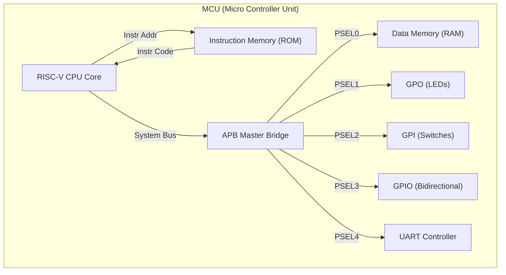
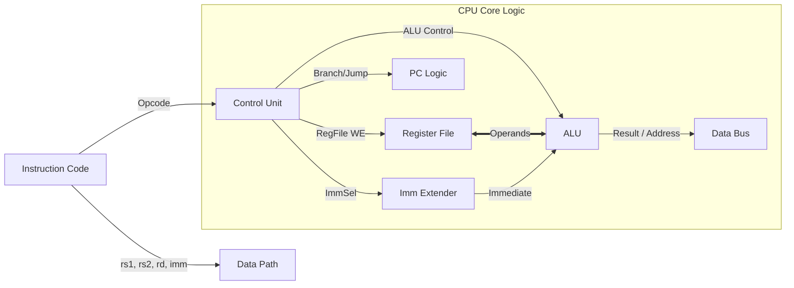

# 🚀 SystemVerilog RISC-V RV32I MCU SoC

\<div align="center"\>

\
\
\
\
\

**32-bit RISC-V CPU Core + APB Interconnect + Peripherals (GPIO, UART)**<br>
FSM 기반의 CPU 코어와 표준 버스 프로토콜을 적용하여 FPGA 상에서 동작하는 임베디드 MCU 시스템

\</div\>

-----

## 📖 1. 프로젝트 개요 (Overview)

이 프로젝트는 **SystemVerilog**를 사용하여 **RISC-V RV32I (Base Integer Instruction Set)** 프로세서를 설계하고, 이를 **AMBA APB (Advanced Peripheral Bus)** 프로토콜을 통해 메모리 및 다양한 주변장치와 통합한 **SoC(System on Chip)** 설계입니다.
단순한 연산 장치를 넘어, 스위치, LED, UART와 같은 I/O를 제어하고, **객체 지향(OOP)** 기반의 테스트벤치를 통해 시스템의 신뢰성을 검증했습니다.

### ✨ 핵심 설계 특징 (Key Features)

  * [cite_start]**RISC-V Core:** `FETCH` → `DECODE` → `EXE` → `MEM` → `WB` 단계의 FSM 제어 방식을 적용한 RV32I 프로세서[cite: 1340].
  * [cite_start]**Bus System:** 표준 **AMBA APB 3.0 Protocol**을 구현한 Master Bridge를 통해 시스템 확장성 확보[cite: 1130].
  * **Memory Architecture:**
      * **Instruction Memory (ROM):** 프로그램 코드 저장 (R/W 불가).
      * **Data Memory (RAM):** APB 슬레이브로 동작하는 4KB 데이터 저장소.
  * **Peripherals:**
      * [cite_start]**GPIO:** GPO(LED), GPI(Switch), GPIO(입출력) 모듈 탑재[cite: 302, 999, 1363].
      * [cite_start]**UART:** 송수신(Tx/Rx) 및 상태 레지스터를 갖춘 시리얼 통신 컨트롤러[cite: 381].
  * [cite_start]**Advanced Verification:** Transaction, Driver, Monitor, Scoreboard 클래스를 활용한 **Constrained Random Verification** 환경 구축[cite: 1184].

-----

## 🏗️ 2. 시스템 아키텍처 (System Architecture)

### 2.1 MCU Top-Level Diagram

CPU는 명령어 버스와 데이터 버스가 분리된 Harvard Architecture 구조를 가지며, 데이터 버스는 APB Bridge를 통해 주변 장치들과 연결됩니다.



### 2.2 APB Memory Map

[cite_start]`APB_Master` 내부의 디코더에 의해 주소 공간이 다음과 같이 할당됩니다 [cite: 1161-1166].

| Slave Device | Base Address | Description | PSEL Index |
| :--- | :--- | :--- | :---: |
| **RAM** | `0x1000_0000` | 데이터 메모리 (R/W) | PSEL0 |
| **GPO** | `0x1000_1000` | 출력 포트 (LED 제어) | PSEL1 |
| **GPI** | `0x1000_2000` | 입력 포트 (Switch 읽기) | PSEL2 |
| **GPIO** | `0x1000_3000` | 범용 입출력 포트 | PSEL3 |
| **UART** | `0x1000_4000` | 시리얼 통신 (Tx/Rx) | PSEL4 |

### 2.3 CPU Core Microarchitecture

CPU 내부는 제어 신호를 생성하는 **Control Unit**과 실제 연산을 수행하는 **Data Path**로 구성됩니다.



-----

## 💻 3. 상세 기능 명세 및 동작 원리 (Detailed Specification)

각 명령어 타입별 \*\*데이터 흐름(Data Flow)\*\*과 **제어 신호(Control Signal)** 동작 방식입니다.

### 3.1 R-Type (Register-Register)

레지스터 간의 산술 및 논리 연산을 수행합니다.

  * **Instructions:** `ADD`, `SUB`, `SLL`, `SLT`, `XOR`, `SRL`, `OR`, `AND` 등.
  * **Data Flow:**
    1.  ROM에서 명령어를 인출(Fetch)합니다.
    2.  Register File에서 `rs1`, `rs2` 데이터를 읽어 ALU로 전달합니다.
    3.  ALU 연산 결과가 MUX(0번 입력)를 통해 다시 Register File(`rd`)에 저장됩니다.
  * **Control Signals:**
      * `reg_wr_en = 1`: 연산 결과를 저장하기 위해 활성화.
      * `aluSrcMuxSel = 0`: 두 번째 피연산자로 레지스터값(`rs2`) 선택.
      * `RegWdataSel = 0`: ALU 결과를 저장 데이터로 선택.

### 3.2 I-Type (Immediate / Load)

상수 연산 또는 메모리 로드 명령을 수행합니다.

  * **Instructions:** `ADDI`, `ANDI`, `LB`, `LW`, `JALR` 등.
  * **Data Flow (Arithmetic):**
    1.  `rs1` 값과 확장된 `imm` 값이 ALU에서 연산됩니다.
    2.  결과가 Register File에 저장됩니다.
  * **Data Flow (Load):**
    1.  ALU에서 `rs1 + imm` 주소를 계산합니다.
    2.  APB Bus를 통해 RAM의 해당 주소 데이터를 읽어 MUX(1번 입력)를 통해 Register File에 저장합니다.
  * **Control Signals (Load):**
      * `reg_wr_en = 1`: 데이터 저장을 위해 활성화.
      * `aluSrcMuxSel = 1`: 주소 계산을 위해 상수(`imm`) 선택.
      * `RegWdataSel = 1`: 메모리에서 읽은 데이터(`busRData`) 선택.

### 3.3 S-Type (Store)

레지스터의 값을 메모리에 저장합니다.

  * **Instructions:** `SB` (Byte), `SH` (Half), `SW` (Word).
  * **Data Flow:**
    1.  `rs1 + imm`을 통해 저장할 메모리 주소를 계산합니다.
    2.  `rs2`의 값을 RAM(또는 Peripheral)의 데이터 포트로 전달합니다.
  * **Control Signals:**
      * `busWe (d_wr_en) = 1`: 버스 쓰기 활성화.
      * `aluSrcMuxSel = 1`: 주소 계산용 상수 선택.

### 3.4 B-Type (Branch)

조건부 분기를 수행합니다.

  * **Instructions:** `BEQ`, `BNE`, `BLT`, `BGE` 등.
  * **Data Flow:**
    1.  비교기(Comparator)가 `rs1`과 `rs2`를 비교하여 `b_taken` 신호를 생성합니다.
    2.  [cite_start]`b_taken`이 참이면 `PC = PC + imm`, 거짓이면 `PC = PC + 4`로 업데이트됩니다[cite: 1411].
  * **Control Signals:**
      * `branch = 1`: 분기 명령어임을 알림.
      * `aluSrcMuxSel = 0`: 비교를 위해 레지스터값 선택.

### 3.5 U-Type (Upper Immediate)

상위 20비트 상수를 처리합니다.

  * **Instructions:** `LUI`, `AUIPC`.
  * **Data Flow:**
    1.  20비트 `imm`을 32비트로 확장(하위 12비트 0)합니다.
    2.  `LUI`: 확장된 값을 그대로 저장. `AUIPC`: `PC + imm` 값을 저장.
  * **Control Signals (LUI):**
      * `RegWdataSel = 2`: ALU를 거치지 않은 Immediate 값 선택.

### 3.6 J-Type (Jump)

무조건 점프 및 복귀 주소 저장을 수행합니다.

  * **Instructions:** `JAL`, `JALR`.
  * **Data Flow:**
    1.  점프할 주소(`PC + imm` 또는 `rs1 + imm`)를 계산하여 PC를 업데이트합니다.
    2.  복귀 주소(`PC + 4`)를 Register File에 저장합니다.
  * **Control Signals:**
      * `jal = 1`: PC 점프 활성화.
      * `RegWdataSel = 4`: `PC + 4` 값을 저장 데이터로 선택.

-----

## 🔌 4. 버스 및 주변장치 설계 (Bus & Peripherals)

### 4.1 APB Master Bridge (`APB_Master.sv`)

CPU의 메모리 접근 신호를 받아 표준 APB 프로토콜의 `SETUP` 및 `ACCESS` 페이즈를 생성합니다.

  * [cite_start]**State Machine:** `IDLE` ↔ `SETUP` ↔ `ACCESS` 상태를 순환하며 `PSEL`, `PENABLE` 타이밍을 제어합니다[cite: 1136].
  * **Signal Routing:** 주소의 상위 비트를 디코딩하여 5개의 Slave 중 하나를 선택(`PSELx`)합니다.

### 4.2 UART Peripheral (`UART_ph.sv`)

APB 버스와 UART 모듈 간의 인터페이스를 담당합니다.

  * **Registers:**
      * [cite_start]`0x00`: TX Data Write (쓰기 시 전송 시작)[cite: 392].
      * [cite_start]`0x04`: RX Data Read[cite: 393].
      * [cite_start]`0x08`: Status Register (TX Busy, RX Ready 확인)[cite: 393].

-----

## 🧪 5. 검증 및 시뮬레이션 (Verification)

SystemVerilog OOP 기능을 활용한 계층적 테스트벤치를 통해 버스 동작과 주변장치를 정밀 검증했습니다.

### 5.1 Verification Environment (`tb_master_uart.sv`)

  * [cite_start]**Transaction:** 랜덤 주소 및 데이터를 생성하며, `constraint`를 통해 유효한 주소 범위(TX/RX Reg)를 제한합니다[cite: 1189].
  * **Driver (`apbSignal`):** 생성된 트랜잭션을 APB 프로토콜(Write/Read Task)에 맞춰 신호를 인가합니다.
  * [cite_start]**Scoreboard (`check`):** APB로 쓴 데이터가 UART Tx로 제대로 나가는지, UART Rx로 들어온 데이터가 APB Read로 읽히는지 자동 비교합니다[cite: 1211].

### 5.2 Simulation Scenarios

1.  **TX Test:** APB Write로 데이터 전송 → UART Tx 라인 모니터링 → 데이터 일치 확인.
2.  **RX Test:** UART Rx 라인으로 데이터 주입 → APB Read로 데이터 수신 → 데이터 일치 확인.
3.  **CPU Integration Test (`tb_rv32i.sv`):** `ROM`에 저장된 어셈블리 코드를 실행하여 R/I/S/B/U/J 명령어의 정상 동작을 파형으로 확인.

-----

## 📂 6. 디렉토리 구조 (Directory Structure)

```text
📦 RISCV-SoC-Project
 ┣ 📂 src
 ┃ ┣ 📂 core              # CPU Core Logic
 ┃ ┃ ┣ 📜 CPU_RV32I.sv    # CPU Top Module
 ┃ ┃ ┣ 📜 ControlUnit.sv  # FSM Controller & Decoder
 ┃ ┃ ┣ 📜 DataPath.sv     # ALU, Registers, PC Logic
 ┃ ┃ ┗ 📜 defines.sv      # Opcode Definitions
 ┃ ┣ 📂 bus               # Bus Interconnect
 ┃ ┃ ┣ 📜 APB_Master.sv   # APB Bridge Controller
 ┃ ┃ ┗ 📜 APB_Slave.sv    # Generic APB Slave
 ┃ ┣ 📂 peripheral        # IO Modules
 ┃ ┃ ┣ 📜 GPO.sv          # General Purpose Output
 ┃ ┃ ┣ 📜 GPI.sv          # General Purpose Input
 ┃ ┃ ┣ 📜 GPIO.sv         # Bidirectional IO
 ┃ ┃ ┣ 📜 UART_ph.sv      # UART Controller Wrapper
 ┃ ┃ ┗ 📜 RAM.sv          # Data Memory (APB Slave)
 ┃ ┣ 📜 ROM.sv            # Instruction Memory
 ┃ ┗ 📜 MCU.sv            # [System Top] SoC Integration
 ┣ 📂 sim                 # Verification
 ┃ ┣ 📜 tb_rv32i.sv       # System Level Simulation
 ┃ ┗ 📜 tb_master_uart.sv # UVM-style Bus Verification
 ┗ 📜 MY_Basys-3-Master.xdc # FPGA Constraints
```

-----

## 🚀 7. 실행 가이드 (How to Run)

1.  **Vivado 실행:** Xilinx Vivado Design Suite를 실행하고 **Basys 3** 보드를 타겟으로 프로젝트를 생성합니다.
2.  **소스 추가:** `src` 및 `sim` 폴더 내의 모든 `.sv` 파일과 `.xdc` 파일을 프로젝트에 추가합니다.
3.  **시뮬레이션 수행:**
      * **SoC 전체 검증:** `tb_rv32i.sv`를 Top으로 설정 후 실행.
      * **Bus/UART 검증:** `tb_master_uart.sv`를 Top으로 설정 후 실행.
4.  **FPGA 구현:** `Run Synthesis` -\> `Run Implementation` -\> `Generate Bitstream`을 실행하여 하드웨어에 배포합니다.

-----

> *Designed with SystemVerilog for RISC-V Architecture Study*

```
```
